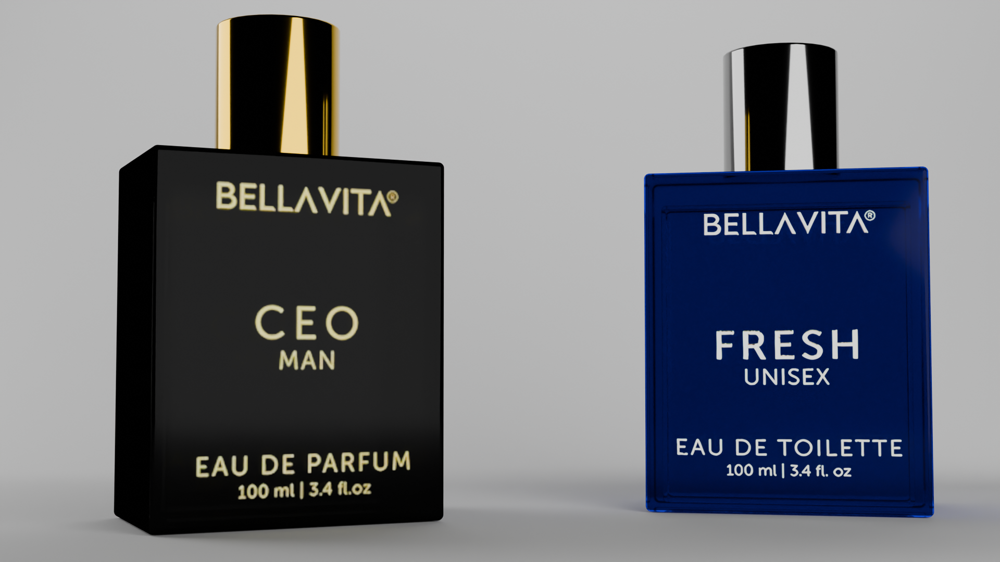

# Luxury Perfume Product Display

## Overview

This project showcases a sophisticated 3D product display of a luxury perfume, created using Blender. The display highlights the elegance and exclusivity of the perfume, focusing on its design and visual appeal.

## Features

- **Perfume Design**: A meticulously crafted perfume bottle that exudes luxury and refinement.
- **Lighting**: Expertly designed lighting to enhance the visual appeal and create a captivating atmosphere.

## Author

- **Design, Camera Work, and Lighting**: The entire project, including the design of the perfume bottle, camera work, and lighting, was created by [Utkarsh MIshra](https://utkarsh-creates.github.io/). This display is an expression of my passion for high-end product visualization and 3D design.

## Tools and Software

- **Blender**: The project was developed and rendered using Blender, an open-source 3D creation suite.

## Usage

You are welcome to explore the project files, experiment with different lighting and camera setups, and gain insights into high-end product visualization techniques.

## Important Notice

This project includes logos and designs of real luxury brands solely for creative purposes. There is no official affiliation, association, or endorsement by any of the actual brands. The use of these elements is for educational and illustrative purposes only and should not be interpreted as an official representation or endorsement.
